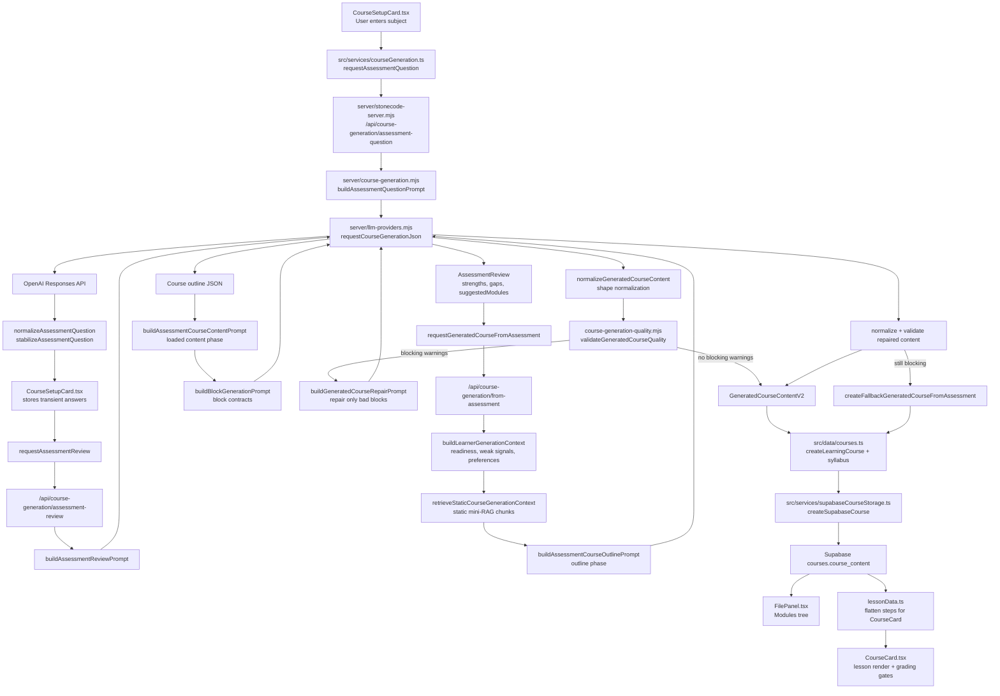
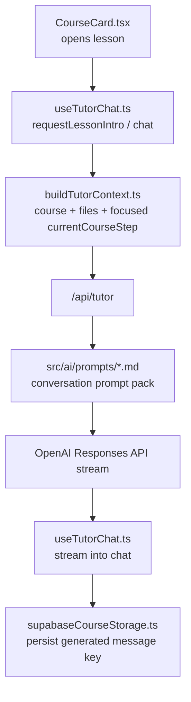

# AI Generation Flow

This diagram shows the current assessment-to-course-generation path and the main files involved.

## Runtime Tutor Context

## QA Script

`npm run qa:generated-course-flow -- --subject "JavaScript fundamentals" --profile struggling`

The QA script runs:

1. AI assessment questions.
2. Simulated learner answers.
3. AI assessment review.
4. AI course outline.
5. AI loaded course content.
6. Server normalization.
7. Quality validation.
8. Repair pass when blocking warnings exist.
9. Artifact/report save under `output/qa/generated-course-flow/`.
